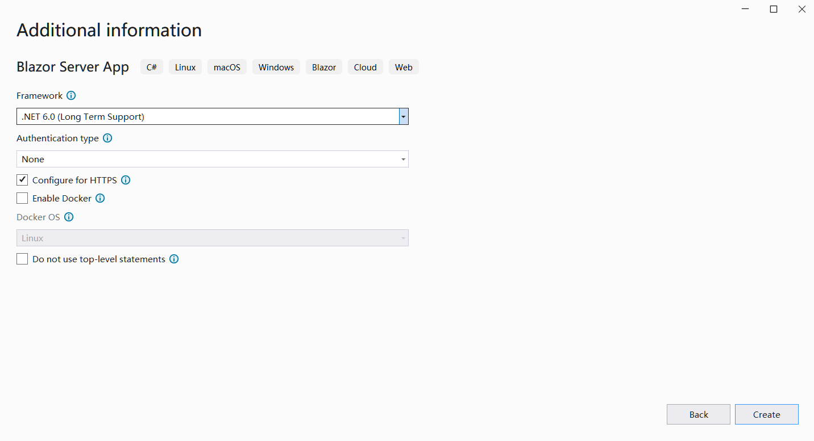
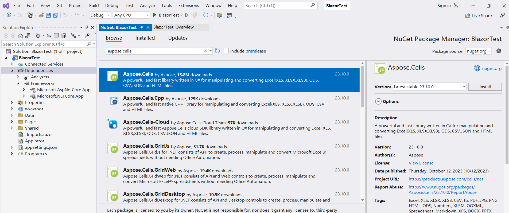

##  Genel Bakış

 Blazor'da Aspose.Cells'i çalıştırmak için .NET6 (veya üstü) platformlarına ihtiyacınız vardır, önceki platformlarla (.netcore31 veya öncesi) karşılaştırıldığında, önemli bir fark grafik kitaplığıyla ilgilidir. Bu resmi makamda[Microsoft Belge](https://learn.microsoft.com/en-gb/dotnet/core/compatibility/core-libraries/6.0/system-drawing-common-windows-only).NET6 veya üzeri sürümler için "System.Drawing.Common" grafik kitaplığının yalnızca Windows'de destekleneceğini açıklar ve grafik kitaplığının değiştirilmesine ilişkin öneriler verir.

Apose.Cells ürünü için değerlendirmeyi gerçekleştirdik ve grafik kütüphanesinin geçişini tamamladık. Microsoft'in resmi belgelerinde önerildiği gibi, Windows olmayan sistemlerde System.Drawing.Common yerine SkiaSharp'ı kullanıyoruz. Bu kritik değişikliğin .Net6 için Aspose.Cells 22.10.1 veya sonrasında geçerli olacağını lütfen unutmayın.

##  Aspose.Cells ile İlk Blazor Uygulaması

Bu örnekte, bazı veriler ve grafikler ekleyen ve bunları web sayfasında görüntülenecek görüntülere dönüştüren basit bir blazor sunucu uygulaması oluşturacaksınız. Proje oluşturma sürecinde seçenekleri kendi ihtiyaçlarınıza göre yapılandırabilirsiniz. Örneğin, "Docker'ı Etkinleştir" seçeneğini işaretlediğinizde, blazor uygulaması daha sonra Docker'da oluşturulabilir ve çalıştırılabilir.

###  İlk Blazor Uygulamasını Oluşturun

Aspose.Cells ile ilk blazor uygulamasını oluşturmak için VS2022 aracını örnek olarak kullanalım, aşağıdaki adımları izleyin:
1. İlgili proje şablonunu seçmek için Dosya ->Yeni ->Proje'yi seçin ve blazer anahtar sözcüğünü kullanarak filtreleyin.
<br>

1. Proje adını "BlazorTest" olarak ayarlayın ve yolu seçin.
<br>

1. Projede kullanılan kitaplıkları ve diğer seçenekleri yapılandırın. Son olarak, ilk blazer projenizi oluşturmak için "Oluştur" düğmesine tıklayın.
<br>

1. Projeye giriş yaptıktan sonra projenin altındaki "Bağımlılıklar"a tıklayın ve "NuGet Paketlerini Yönet..." seçeneğini seçerek Aspose.Cells kütüphanesini ekleyin.
<br>

1. Filtrelemek için anahtar sözcükleri girin ve en son Aspose.Cells kitaplığını yükleyin. SkiaSharp gibi eş zamanlı olarak bağımlı kütüphaneler de birlikte kurulacaktır.
<br>

1. Gerekli kütüphaneyi düzenlemek ve içe aktarmak için "Index.razor" dosyasına çift tıklayın. Bazı veriler ve grafikler ekleyin ve bunları görüntülenmek üzere grafiklere dönüştürün.
<br>

1. Projeyi derleyip çalıştırdığınızda aşağıdaki sonuçları elde edeceksiniz.
<br>


###  İlk Blazor Uygulamasındaki Örnek Kod

Aşağıdaki örnek kod Index.razor dosyasında bulunur:
```
@page "/"
@using SkiaSharp;
@using Aspose.Cells;
@using Aspose.Cells.Drawing;
@using Aspose.Cells.Rendering;


<PageTitle>Index</PageTitle>

<h1>Hello, world!</h1>

Welcome to your new app.

<SurveyPrompt Title="How is Blazor working for you?" />


@code
{
    private string imageSrc;

    public Index()
    {
        imageSrc = "data:image/png;base64, " + Convert.ToBase64String(CreateFile());
    }

    private byte[] CreateFile()
    {
        Workbook workbook = new Workbook();
        Worksheet sheet = workbook.Worksheets[0];
        sheet.Cells["A1"].Value = "test data for blazor";

        sheet.PageSetup.PrintGridlines = true;
        sheet.PageSetup.PrintArea = "A1:F20";

        ShapeCollection shapes = sheet.Shapes;

        //Add rectangle shape
        shapes.AddRectangle(1, 0, 1, 0, 100, 150);

        //Add line shape
        shapes.AddLine(8, 0, 1, 0, 100, 150);

        //Add oval shape
        shapes.AddOval(13, 0, 1, 0, 100, 150);

        using MemoryStream ms = new();

        SheetRender render = new SheetRender(sheet, new ImageOrPrintOptions());
        render.ToImage(0, ms);

        return ms.ToArray();
    }
}

```